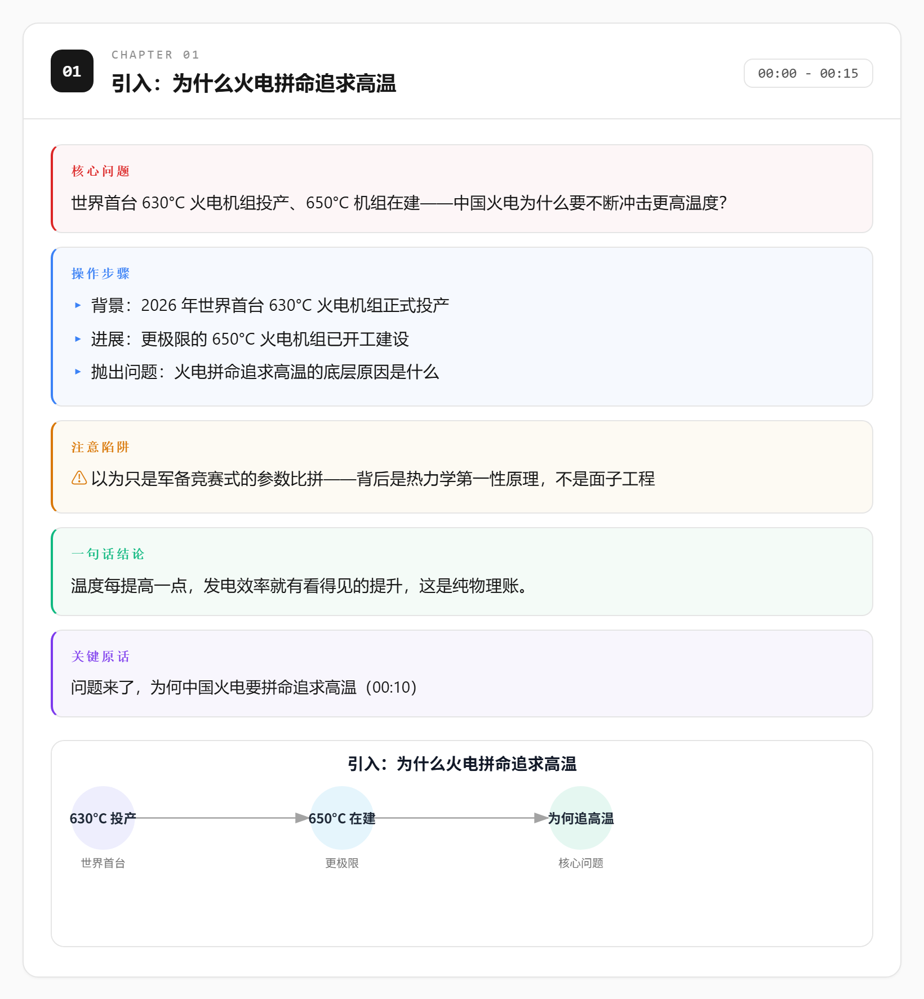

<div align="center">

# bilibili-analyze

**从 B 站视频链接，到一份带 SVG 图表的离线 HTML 笔记**


<a href="LICENSE"></a>

<br>

<a href="SKILL.md">Skill 文档</a> ｜
<a href="examples/">示例输出</a> ｜
<a href="CHANGELOG.md">更新日志</a> ｜
<a href="https://github.com/juejuexuan/bilibili-analyze-skill/issues">Issue</a>

<br><br>



</div>

bilibili-analyze 是一个面向 AI Agent 的 B 站视频深度分析流水线。给它一条视频链接，它自动完成下载、字幕/Whisper 转写、内容分章、SVG 图表生成、单文件离线笔记构建与章节截图，并可选择性导出到 Obsidian。适合教程类、科普类、深度学习类视频的知识沉淀与归档。可作为独立脚本使用，也原生支持 Kimi Code / Claude Code / Codex 的 Skill 机制。

## 核心特性

1. ⚡ 并行下载：元数据、最佳音频、封面、CC 字幕一次抓齐（基于 yt-dlp）。
2. 📝 智能转写：有 CC 字幕直接解析，节省约 80% 时间；无字幕时 Whisper 转写，faster-whisper 优先、openai-whisper 兜底。
3. 🧠 AI 分章：按视频自然结构提炼「核心问题 / 操作步骤 / 注意陷阱 / 结论 / 关键原话」。
4. 📊 动态 SVG：每章按内容类型生成 flow / timeline / matrix / decision_tree / causal 五类图表，全部真实数据、无占位装饰。
5. 🌙 现代界面：文档站美学，目录导航、暗色模式跟随系统，移动端与打印友好。
6. 📷 章节截图：Chrome headless + CDP `clip` 精确截取每章，自动合并整页长图，并发任务互不干扰。
7. 🗂️ Obsidian 导出（可选）：生成带 YAML frontmatter 的 Markdown 笔记，逐章嵌入截图。

## 效果预览

<table>
  <tr>
    <td></td>
    <td></td>
  </tr>
  <tr>
    <td></td>
    <td></td>
  </tr>
</table>

> 完整示例见 [`examples/`](examples/)，选自中科院官方账号「中国科普博览」的公开科普视频，已移除音频与转写，无任何推广内容。

## 快速开始

### 环境依赖

| 工具 | 最低版本 | 安装 |
|------|---------|------|
| Python | 3.10+ | https://python.org |
| yt-dlp | 2024+ | `pip install yt-dlp` |
| ffmpeg / ffprobe | 6.0+ | `winget install ffmpeg` / `apt install ffmpeg` |
| Chrome / Chromium | 120+ | 用于 headless 截图 |
| Whisper 模型 | small / turbo | 首次运行自动下载到 `~/.cache/whisper/` |

> [!TIP]
> 安装后先跑 `python scripts/preflight.py` 一键体检，全部 `[OK]` 即可开工。

### 安装

```bash
git clone https://github.com/juejuexuan/bilibili-analyze-skill.git
cd bilibili-analyze-skill
pip install -r requirements.txt
```

作为 Agent Skill 使用（复制或符号链接整个目录）：

- Kimi Code / Claude Code → `~/.agents/skills/bilibili-analyze/`
- Codex → `~/.codex/skills/bilibili-analyze/`

### 四阶段命令

```bash
# Phase 1: 下载（元数据/音频/封面并行）
python scripts/download.py "https://www.bilibili.com/video/BVxxxx" --workdir output

# Phase 2: 转写（CC 字幕优先，否则 Whisper）
python scripts/transcribe.py output/BVxxxx/state.json

# Phase 3: 分章后构建 HTML（chapters.json 由 AI 按 assets/chapters.template.json 生成）
python scripts/build_page.py output/BVxxxx/state.json

# Phase 4: 章节截图
python scripts/screenshot_sections.py output/BVxxxx/analysis.html
```

> [!NOTE]
> 分章 JSON 的结构、SVG 类型选择规则与 Agent 执行规则详见 [`SKILL.md`](SKILL.md)；交互式流水线全景见 [`assets/workflow.html`](assets/workflow.html)。

## Obsidian 导出（可选）

```bash
python scripts/export_obsidian.py output/BVxxxx --vault /path/to/your/vault
```

| 参数 | 环境变量 | 默认值 | 说明 |
|------|---------|--------|------|
| `--vault` | `BILIBILI_ANALYZE_VAULT` | 无（二者至少提供一个） | Obsidian vault 根目录 |
| `--notes-dir` | — | `bilibili-notes` | vault 内笔记相对目录 |
| `--attachments-dir` | — | `bilibili-attachments` | vault 内附件相对目录 |

笔记 frontmatter 含 `title` / `source` / `up` / `date` / `duration` / `bv`；带 `#` 的 B 站标签会被自动清理，避免 YAML 注入。

## 常见问题

<details>
<summary>下载报 HTTP 412？</summary>

换 `b23.tv` 短链重试；仍失败则导出浏览器 cookies 传入：`python scripts/download.py <url> --workdir output --cookies cookies.txt`。

</details>

<details>
<summary>Whisper 模型下载慢 / 失败？</summary>

模型缓存在 `~/.cache/whisper/`，可手动下载 `small.pt` 放入；或改用更小的模型。

</details>

<details>
<summary>转写末段时长与音频差 5% 以上？</summary>

脚本会自动重试一次；仍异常会标记告警但继续后续阶段，多为视频尾部无声片段所致。

</details>

<details>
<summary>并发截图会不会互相干扰？</summary>

不会。HTTP 服务使用临时端口，Chrome 使用独立 `--user-data-dir`，并校验页面 URL，多任务并行安全。

</details>

## 版本与许可

当前版本见 [`VERSION`](VERSION)，变更历史见 [`CHANGELOG.md`](CHANGELOG.md)，遵循语义化版本。本项目基于 [MIT](LICENSE) 协议开源。

## ⭐ Star History

> [!TIP]
> 如果这个项目对你有帮助，欢迎 Star 支持，这是持续维护的动力 <3

<div align="center">

[](https://star-history.com/#juejuexuan/bilibili-analyze-skill&Date)

</div>

<div align="center">

_让每一小时的视频，都沉淀为一页可检索的笔记。_

</div>
