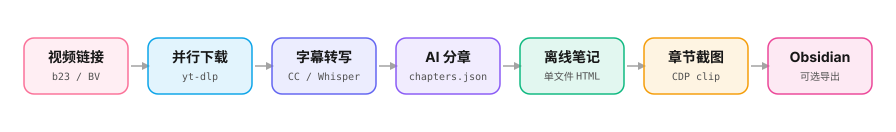
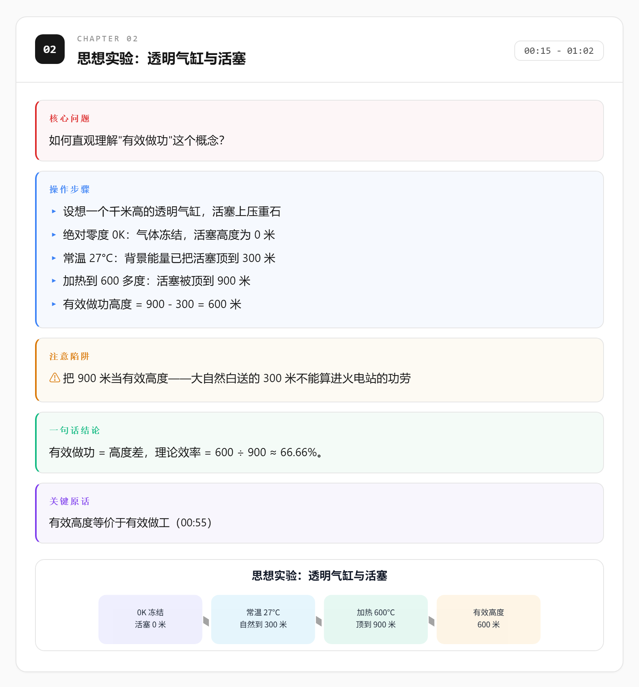
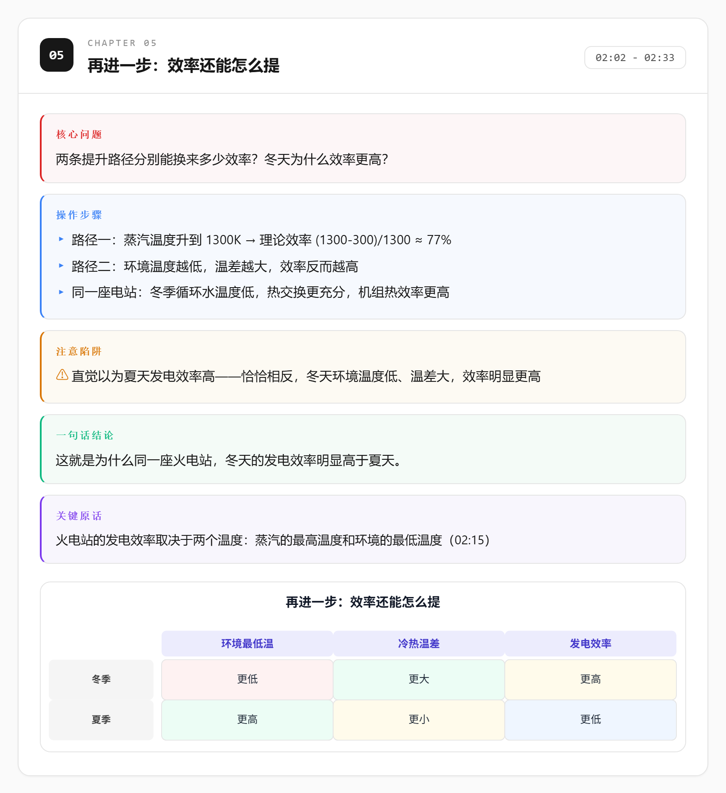
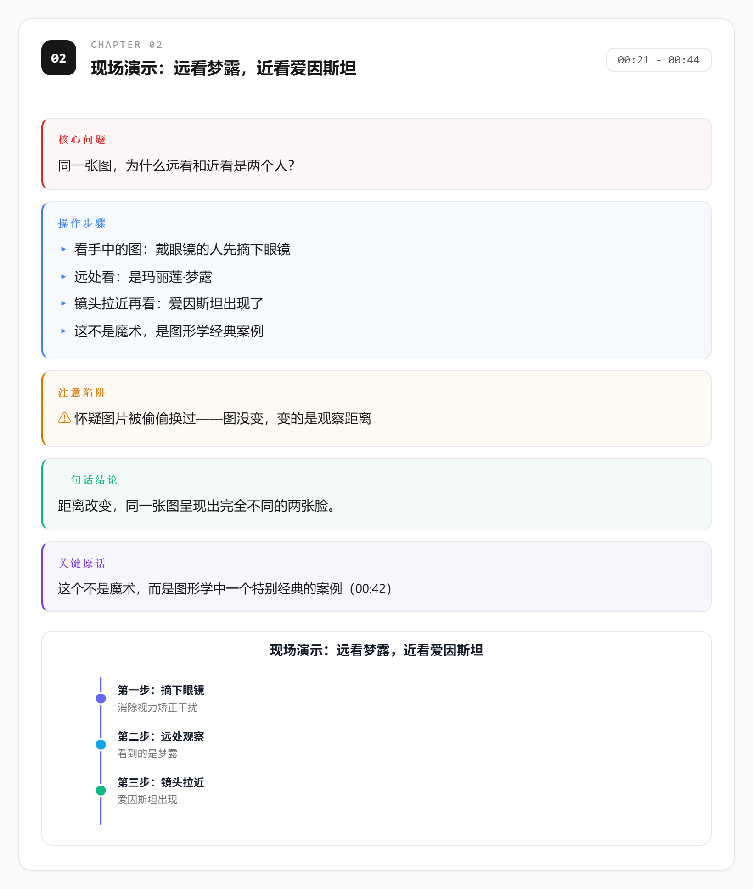
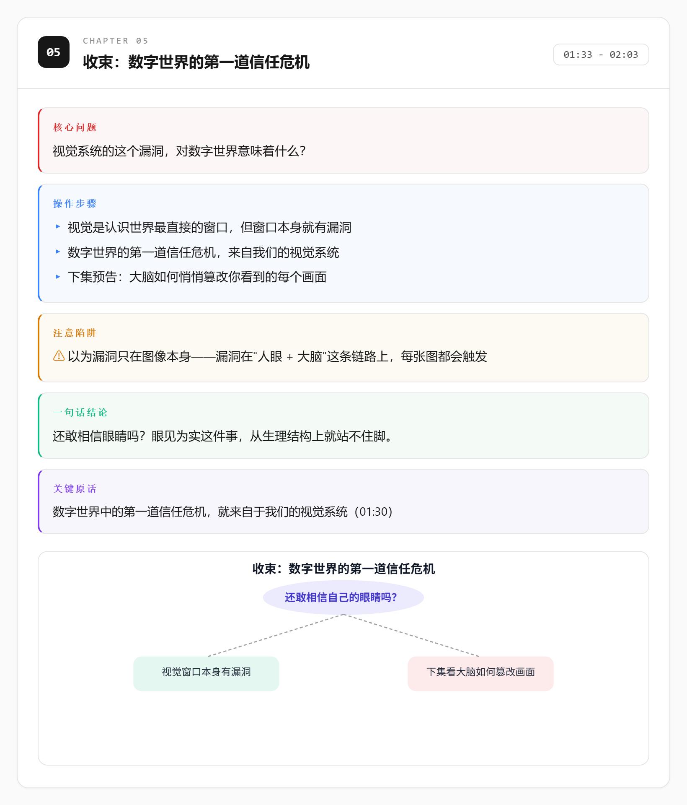

<div align="center">

<a href="README_EN.md">English</a> ｜ <a href="README.md">简体中文</a>

<br>

# bilibili-analyze

**From a Bilibili video link to an offline HTML note with SVG diagrams**


<a href="LICENSE"></a>

<br>

<a href="SKILL.md">Skill Guide</a> ｜
<a href="examples/">Examples</a> ｜
<a href="CHANGELOG.md">Changelog</a> ｜
<a href="https://github.com/juejuexuan/bilibili-analyze-skill/issues">Issues</a>

<br><br>

<picture>
  <source media="(prefers-color-scheme: dark)" srcset="assets/pipeline-dark.svg">
  
</picture>

</div>

bilibili-analyze is a deep-analysis pipeline for Bilibili videos, designed for AI agents. Give it a video link and it automatically downloads assets, transcribes (CC subtitles first, Whisper fallback), splits content into chapters, generates SVG diagrams, builds a single-file offline note, and captures per-section screenshots — with optional export to Obsidian. Great for tutorials, science explainers, and long-form learning content. Works standalone via CLI, or natively as a Skill for Kimi Code / Claude Code / Codex.

## Key Features

1. ⚡ Parallel downloads: metadata, best audio, thumbnail and CC subtitles in one pass (powered by yt-dlp).
2. 📝 Smart transcription: CC subtitles are parsed directly (~80% faster); otherwise Whisper with faster-whisper first and openai-whisper as fallback.
3. 🧠 AI chaptering: each chapter is distilled into "core problem / steps / pitfalls / conclusion / key quote".
4. 📊 Dynamic SVGs: five chart types per chapter — flow, timeline, matrix, decision tree, causal — always real data, never placeholders.
5. 🌙 Modern UI: editorial docs aesthetic, TOC navigation, system-following dark mode, mobile- and print-friendly.
6. 📷 Section screenshots: headless Chrome + CDP `clip` captures each chapter precisely and merges a full-page image; concurrent jobs never interfere.
7. 🗂️ Obsidian export (optional): Markdown notes with YAML frontmatter and per-chapter embedded screenshots.

## Preview

<table>
  <tr>
    <td></td>
    <td></td>
  </tr>
  <tr>
    <td></td>
    <td></td>
  </tr>
</table>

> Full examples live in [`examples/`](examples/), generated from public science videos by 中国科普博览 (an official account of the Chinese Academy of Sciences), sanitized — no audio, transcripts, or promotional content.

## Quick Start

### Requirements

| Tool | Minimum | Install |
|------|---------|---------|
| Python | 3.10+ | https://python.org |
| yt-dlp | 2024+ | `pip install yt-dlp` |
| ffmpeg / ffprobe | 6.0+ | `winget install ffmpeg` / `apt install ffmpeg` |
| Chrome / Chromium | 120+ | for headless screenshots |
| Whisper model | small / turbo | auto-downloaded to `~/.cache/whisper/` on first run |

> [!TIP]
> Run `python scripts/preflight.py` after installing — when everything shows `[OK]`, you're ready.

### Install

```bash
git clone https://github.com/juejuexuan/bilibili-analyze-skill.git
cd bilibili-analyze-skill
pip install -r requirements.txt
```

To use it as an agent Skill (copy or symlink the whole directory):

- Kimi Code / Claude Code → `~/.agents/skills/bilibili-analyze/`
- Codex → `~/.codex/skills/bilibili-analyze/`

### Four Phases

```bash
# Phase 1: download (metadata/audio/thumbnail in parallel)
python scripts/download.py "https://www.bilibili.com/video/BVxxxx" --workdir output

# Phase 2: transcribe (CC subtitles first, otherwise Whisper)
python scripts/transcribe.py output/BVxxxx/state.json

# Phase 3: build HTML after chaptering (chapters.json is written by the AI, see assets/chapters.template.json)
python scripts/build_page.py output/BVxxxx/state.json

# Phase 4: section screenshots
python scripts/screenshot_sections.py output/BVxxxx/analysis.html
```

> [!NOTE]
> Chapter JSON schema, SVG type selection rules and agent execution rules are documented in [`SKILL.md`](SKILL.md); an interactive pipeline overview lives at [`assets/workflow.html`](assets/workflow.html).

## Obsidian Export (Optional)

```bash
python scripts/export_obsidian.py output/BVxxxx --vault /path/to/your/vault
```

| Flag | Env var | Default | Description |
|------|---------|---------|-------------|
| `--vault` | `BILIBILI_ANALYZE_VAULT` | none (provide one of the two) | Obsidian vault root |
| `--notes-dir` | — | `bilibili-notes` | notes directory inside the vault |
| `--attachments-dir` | — | `bilibili-attachments` | attachments directory inside the vault |

Note frontmatter includes `title` / `source` / `up` / `date` / `duration` / `bv`; Bilibili tags starting with `#` are sanitized automatically to avoid YAML issues.

## FAQ

<details>
<summary>HTTP 412 when downloading?</summary>

Retry with a `b23.tv` short link; if it still fails, export browser cookies and pass them in: `python scripts/download.py <url> --workdir output --cookies cookies.txt`.

</details>

<details>
<summary>Whisper model download slow or failing?</summary>

Models are cached in `~/.cache/whisper/` — you can drop a manually downloaded `small.pt` there, or fall back to a smaller model.

</details>

<details>
<summary>Last transcript segment differs from audio duration by over 5%?</summary>

The script retries once automatically; if it still differs it warns and continues — usually just a silent outro segment.

</details>

<details>
<summary>Will concurrent screenshot jobs interfere?</summary>

No. The HTTP server uses an ephemeral port, Chrome gets an isolated `--user-data-dir`, and the page URL is verified — safe for parallel runs.

</details>

## Version & License

Current version in [`VERSION`](VERSION), history in [`CHANGELOG.md`](CHANGELOG.md) — semantic versioning. Released under the [MIT](LICENSE) license.

## ⭐ Star History

> [!TIP]
> If this project helps you, a star means a lot — it's what keeps maintenance going <3

<div align="center">

[](https://star-history.com/#juejuexuan/bilibili-analyze-skill&Date)

</div>

<div align="center">

_Turn every hour of video into one searchable page of notes._

</div>
